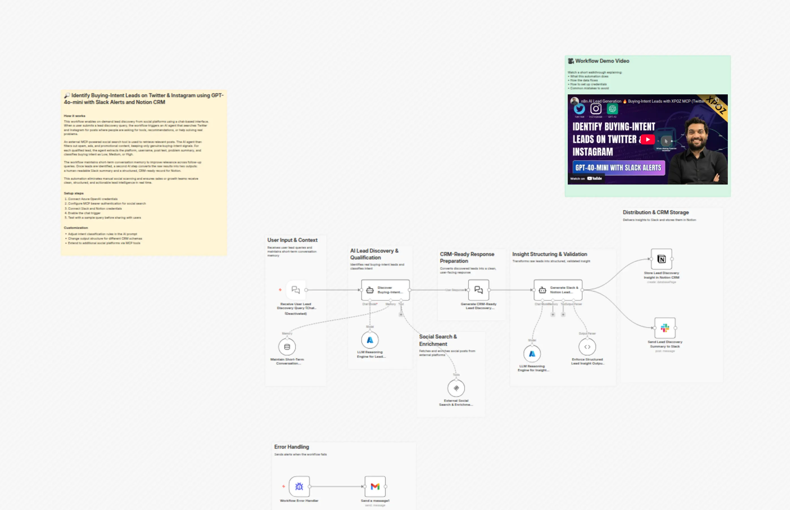
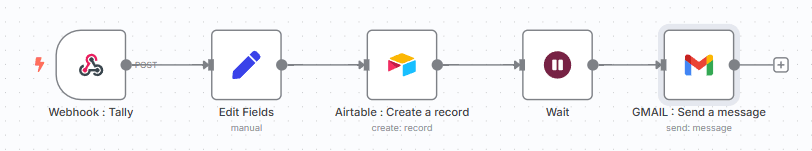
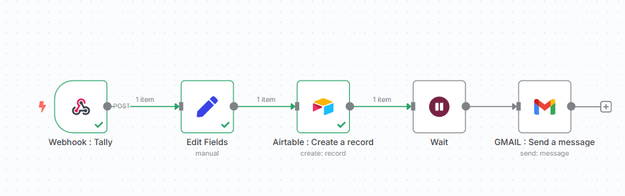
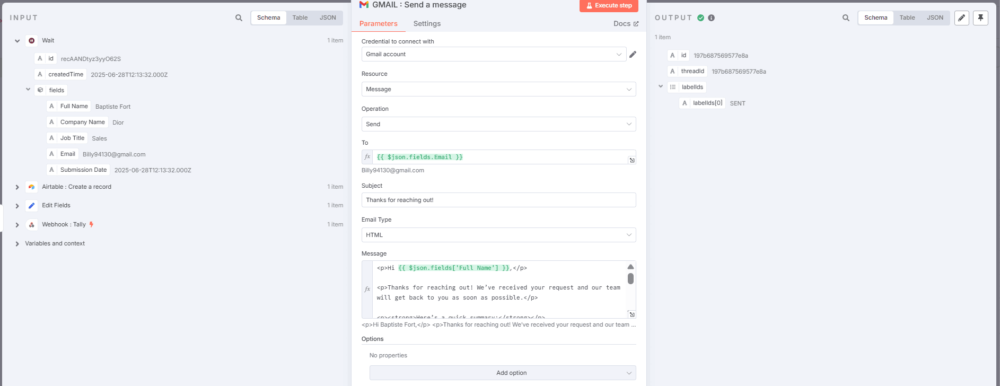
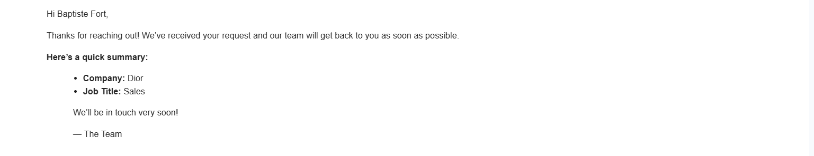
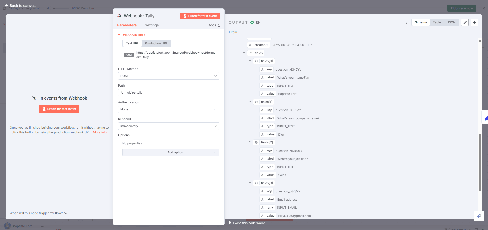
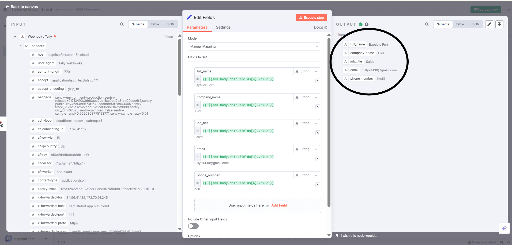
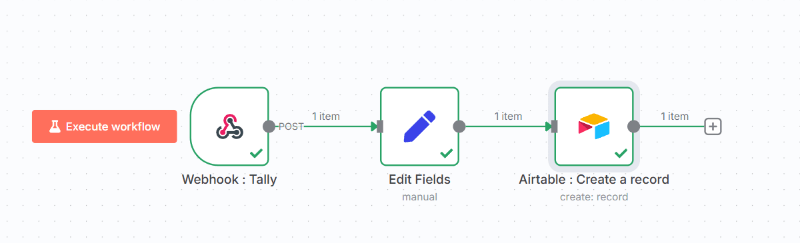
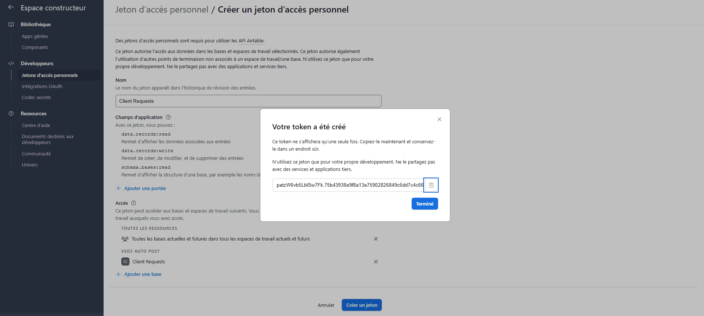
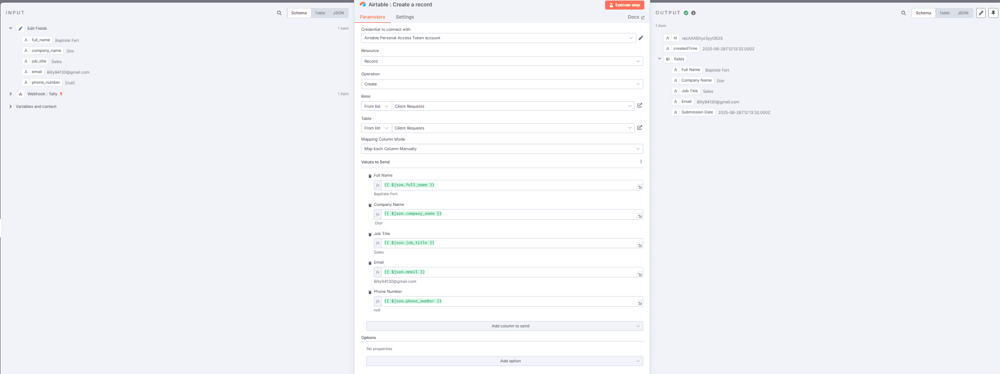

# Identify buying-intent leads on Twitter and Instagram with Slack and Notion CRM

Advanced n8n automation for Identify buying-intent leads on Twitter and Instagram with Slack and Notion CRM.

## Overview
- Category: Lead Generation, AI RAG
- Complexity: advanced
- Source: n8n workflow template export

## What This Automation Does
Chat-driven social lead discovery for X/Instagram: AI filters real buying intent, scores leads, and sends Slack summaries + Notion CRM records. Learn more.

## Included Files
- `workflow.json`

## Setup
1. Import `workflow.json` into n8n.
2. Configure required credentials for the services used in the workflow nodes.
3. Update any environment variables or static values inside nodes (API keys, URLs, IDs).
4. Run a test execution and then activate the workflow.

## Tech Stack

- `@n8n/n8n-nodes-langchain.agent`
- `@n8n/n8n-nodes-langchain.chat`
- `@n8n/n8n-nodes-langchain.chatTrigger`
- `@n8n/n8n-nodes-langchain.lmChatAzureOpenAi`
- `@n8n/n8n-nodes-langchain.mcpClientTool`
- `@n8n/n8n-nodes-langchain.memoryBufferWindow`
- `@n8n/n8n-nodes-langchain.outputParserStructured`
- `n8n-nodes-base.errorTrigger`
- `n8n-nodes-base.gmail`
- `n8n-nodes-base.notion`
- `n8n-nodes-base.slack`
- `n8n-nodes-base.stickyNote`

## Author

Murtaza Baig

## Screenshots

## License
MIT License. See `LICENSE`.